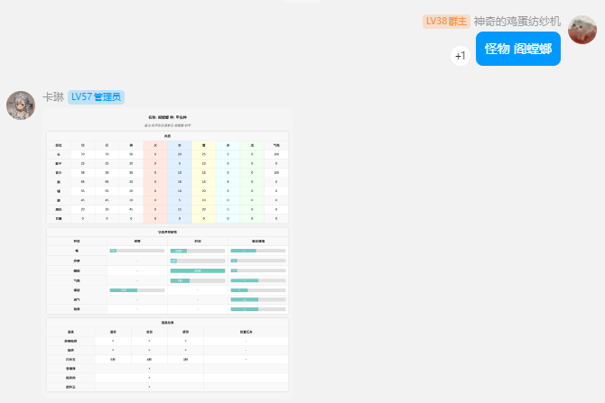
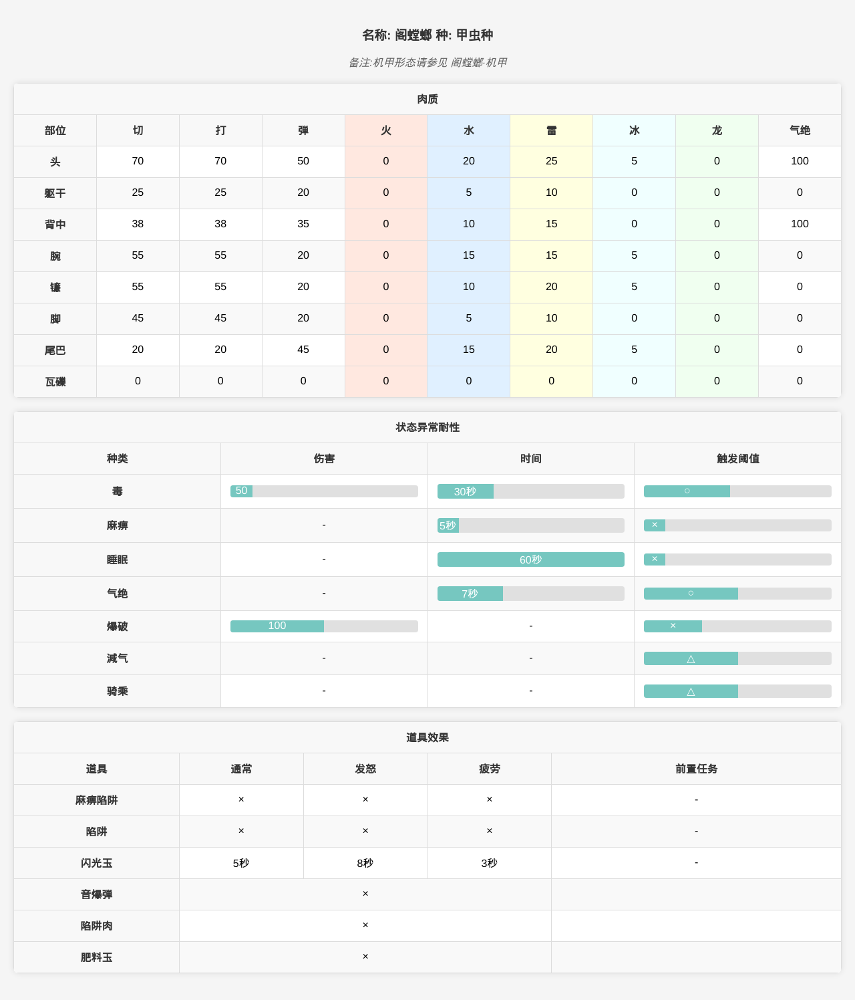

# koishi-plugin-mhgu-helper

## 简介  
此插件是基于koishi的怪物猎人GU/XX资料查询插件,目的是让群友更方便的查询怪猎gu/xx资料
,安装即用

## 支持功能  
- ✅怪物资料
- 🚧装备资料
- 🚧技能资料

### 使用示例

## 感谢   
此插件的html页面是对[mhgu](https://github.com/jestar719/mhgu)怪物页面的整理,(非常感谢[jestar719](https://github.com/jestar719)大佬!),从db和html中提取出了怪物的部分数据为json文件并重新渲染为html,提取相关项目:[mhgu-db](https://github.com/LingLambda/mhgu-db)  

## 其他 
此插件仍在开发中!  
如果有问题欢迎提出[Issue](https://github.com/LingLambda/koishi-plugin-mhgu-helper/issues)  
不管有没有问题都欢迎通过abc1514671906@163.com联系我

## License
[MIT](LICENSE) License Copyright (c) 2024 ling
